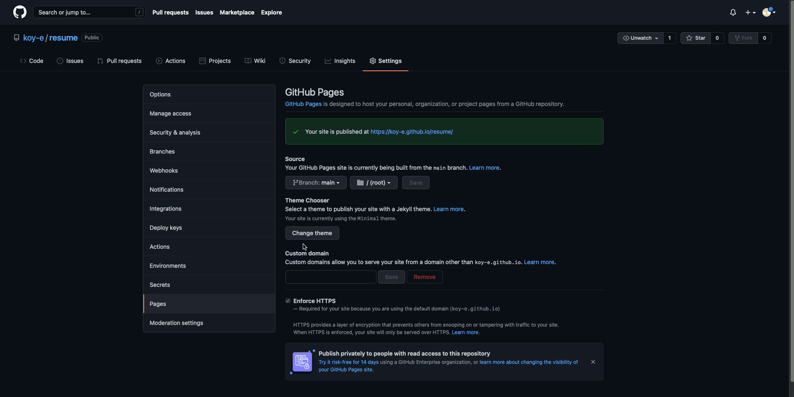

## Making an online resumé

### table of contents

- [Purpose.](#purpose)
- [prerequisites](#prerequisites).
- [Instructions](#Instructions).
    - Use a Lightweight markup Language: Markdown
    - Make static websites: Jekyll
    - Use distributed version control: Github Pages
- [More resources](#More-resources)
- [Authors and aknowlegdements](#Authors-and-Aknowledgements)
- [FAQ](#FAQ)
### **Purpose**
---

Describe the practical steps of how to host and format a resume using Markdown, VScode, GitHub Pages, and Jekyll.

### **Prerequisites**
---

- jekyll.
- VScode.
- github account.
- git installed on computer.
- a resume formatted in markdown.

### **Instructions**
---
a). **_Use a Lightweight markup Language: Markdown_**

Lightweight Markup Languages such as **Markdown** or ASCIIdoc are an easy-to-learn alternative to other markup languages like HTML or XML. While they dont have as many formatting options as other word processors, it is much more straightforward to collaborate with other individuals on with because changes can be merged together much more easily.Overall, they give you the best of both worlds between nicely formatted text and web portability.

To use a Markdown formatted language. we will need a Markdown editor. For this tutorial, we will be using VSCode.

1. go to the VSCode website [here](https://code.visualstudio.com).
2. Open the browser's download list and locate the downloaded archive.
Extract the archive contents. 
3. Use double-click for some browsers or select the 'magnifying glass' icon with Safari.
4. Drag Visual Studio Code.app to the Applications folder, making it available in the macOS Launchpad.
5. Add VS Code to your Dock by right-clicking on the icon to bring up the context menu and choosing Options, Keep in Dock.

b). **_Make static websites: Jekyll_**

Static websites do not have any server-side application depencies or databases and thus are easy to migrate and they never never crash.

Static site generators are tools that help you create your static site. Although you could make a static site without them, they make the task easier by processing everything into a website for you and it is easy to update the site. 

_download jekyll:_ macOS

1. Check what version of ruby you have installed by typing the command, "ruby -v", into your terminal. if you do not have ruby installed, you will have to download it.
2. Check what version of gem you have installed by typing the command, "gem -v" into your terminal. if you do not have gem installed, you will have to download it.
3. Type the command "gem install jekyll bundler" into your terminal to download jekyll. 
4. To ensure that the download worked successfully. type the command "jekyll -v" to check the version of jekyll you have installed.

_create a static site_
1. In VSCode, open a new folder. 
2. In the terminal on VSCode, type the command "jekyll new {site name}" to create some default scsffolding for your site in a new folder. 

c). **_Use distributed version control: Github Pages_**

1. Make a new repository on [GitHub](https://github.com). pick a name for your new repository and ensure that that its visibility is set to public.
2. set the variable "baseurl", In the "config.yml" file, that jekyll created to the name of the repository you have just created. 
3. Navigate to the directory of your static site in your terminal, 
4. Type the command, "git init" to initialize a local repository. 
5. Type the command, "git checkout -b gh-pages" to check out your gh-pages branch. 
6. Type the command, "git status". there should be no commits done yet.
7. Type the command "git add ." to add all the files to the local repository. 
8. Type "git commit m '{first commit message}"', to commit these files to your repository.
9. Copy the link to your github repository.
10. Type the command, "git remote add origin {link to your github repository}" to link your local repository to your github repository. 
11. Type the command, "git push origin gh-pages" to push all changes made in your local repository to your github repository. 
12. On your github settings, under the pages subsection, there is another subsection called source. make sure that the branch field is set to the gh-pages branch (_if that is the branch you used_)and the folder is set to the root (_if the files are in your root directory on your repository_).

 **On the same page, Near the top, you will notice a banner that says,**

 "Your site is published at https://{github username}.github.io/{repository name}/".

 **you may click on that link to view your site.**

### **More Resources**
---

- A [Markdown Tutorial](https://www.markdowntutorial.com).
- [Modern Technical Writing: An Introduction to Software Documentation](https://www.amazon.ca/Modern-Technical-Writing-Introduction-Documentation-ebook/dp/B01A2QL9SS) by Andrew Etter.
- VScode [documentation](https://code.visualstudio.com/docs/languages/markdown) about how to use it with Markdown

### **Authors and Aknowledgements**
---

_Group members:_
- Michael Bathie. 
- Faith De Leon.
- Tuan D. Le. 
- Andy Tan.
- Olukoye Fatoki. 

_Theme authors:_
- [Steve Smith](https://github.com/orderedlist).

### **FAQ**
---
1. Do I need to use VSCode as my markdown editor?

        No. Any markdown editor would probably work the same, if not better than VSCode. It was my personal choice

2. Why is my resume not showing up?

        One possible Issue is that your githup pages source may not be set correctly. Refer to step 13 under the Instructions subsection, "Host your site on github pages".
